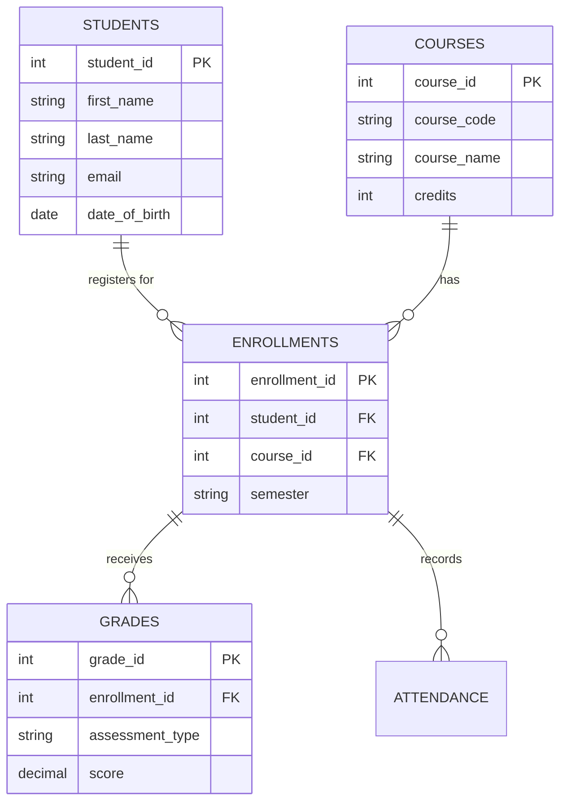
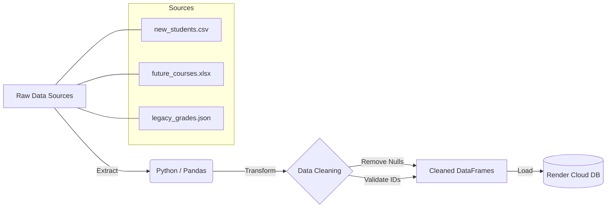

# Student Records Management System 🎓

[](https://python.org)
[](https://postgresql.org)
[](https://render.com)
[]()
[]()

> A robust, cloud-deployed Data Engineering project that manages student academic lifecycles.

---

## 📖 Table of Contents
- [About the Project](#-about-the-project)
- [Key Features](#-key-features)
- [System Architecture](#-system-architecture)
  - [Entity Relationship Diagram](#1-entity-relationship-diagram-erd)
  - [ETL Pipeline](#2-etl-pipeline-flowchart)
  - [Project Structure](#3-project-structure)
- [Getting Started](#-getting-started)
- [Usage Guide](#-usage-guide)
- [Data Analytics](#-data-analytics--insights)
- [Testing & QA](#-testing--quality-assurance)
- [Future Improvements](#-future-improvements)
- [License](#-license)

---

## 🧐 About the Project

The **Student Records Management System** is a comprehensive data engineering solution designed to modernize how educational institutions handle student data. It moves away from scattered spreadsheets to a centralized, normalized cloud database.

By integrating a **multi-source ETL pipeline**, this system ingests data from legacy CSVs, Excel files, and JSON logs, cleanses it, and loads it into a **PostgreSQL** database hosted on Render. A secure CLI allows administrators to manage records efficiently while ensuring data integrity.

### Built With
*   **Language:** Python 3.12
*   **Database:** PostgreSQL 16 (Render Cloud)
*   **Data Processing:** Pandas, NumPy
*   **Validation:** Pydantic (implied/best practice) / Custom Logic
*   **Environment:** Dotenv for security

---

## 🚀 Key Features

*   **Multi-Source ETL**: Seamlessly ingests and merges data from disparate formats:
    *   `CSV` (Student Personal Data)
    *   `Excel` (Course Catalogs)
    *   `JSON` (Historical Grades)
*   **Cloud-First Architecture**: Fully deployed on Render with SSL-secured database connections.
*   **Robust Data Integrity**: Enforces 3rd Normal Form (3NF), validates scores (0–100), checks for duplicates, and maintains referential integrity.
*   **Admin CLI**: Interactive command-line interface for:
    *   Adding Students
    *   Enrolling in Courses
    *   Recording Grades & Attendance
    *   Generating PDF Transcripts
*   **Automated Reporting**: On-demand generation of detailed transcripts and reliable CSV exports.
*   **Unit Testing Suite**: Automated tests verifying business logic (GPA calc) and pipeline data volume.

---

## 🏗 System Architecture

### 1. Entity-Relationship Diagram (ERD)
The database schema is normalized to **3NF** to eliminate redundancy.



### 2. ETL Pipeline Flowchart
Data flows from raw files through a cleaning process before secure loading.



### 3. Project Structure
```text
Student-Records-Management-System/
├── data/                   # Data storage
│   └── raw_data/           # Input files (CSV, XLSX, JSON)
├── src/                    # Source code
│   ├── etl_pipeline.py     # ETL logic
│   ├── cli_app.py          # Admin Interface
│   └── utils.py            # Helper functions
├── tests/                  # Automated tests
├── sql/                    # SQL scripts for schema/queries
├── requirements.txt        # Dependencies
└── README.md               # Project Documentation
```

---

## 🛠 Getting Started

follow these steps to set up the project locally.

### Prerequisites
*   Python 3.10+
*   PostgreSQL (or utilize the cloud config)

### Installation

1.  **Clone the Repository**
    ```bash
    git clone https://github.com/YOUR_USERNAME/Student-Records-Management-System.git
    cd Student-Records-Management-System
    ```

2.  **Install Dependencies**
    ```bash
    pip install -r requirements.txt
    ```

3.  **Configure Environment**
    Create a `.env` file in the root directory:
    ```env
    DB_HOST=dpg-xxxxxx.oregon-postgres.render.com
    DB_NAME=student_records_db_xxxx
    DB_USER=student_user_xxxx
    DB_PASS=your_secret_password
    ```

4.  **Run the ETL Pipeline**
    Initialize the database with seed data:
    ```bash
    python src/etl_pipeline.py
    ```

---

## 💻 Usage Guide

### Administrator CLI
Launch the interactive management console:
```bash
python src/cli_app.py
```

**Menu Options:**
1.  **Add Student**: Registers a new profile (checks for duplicates).
2.  **Enroll Student**: Links a student to a course for a semester.
3.  **Record Grade**: Enters assessment scores with validation.
4.  **Mark Attendance**: Log daily presence (Present/Absent/Late).
5.  **Generate Reports**: Export PDF transcripts or CSV dumps.

---

## 📊 Data Analytics & Insights

The system supports complex SQL queries for academic insights.

**Example 1: Dean’s List (Top 10 Students)**
```sql
SELECT first_name, last_name, ROUND(AVG(score), 2) as gpa
FROM student_transcripts_view
GROUP BY student_id, first_name, last_name
HAVING COUNT(score) > 3
ORDER BY gpa DESC
LIMIT 10;
```

**Example 2: At-Risk Students (Attendance < 75%)**
```sql
SELECT s.last_name, c.course_code, 
       (present_days::decimal / total_days) * 100 as attendance_rate
FROM attendance_stats_view
WHERE (present_days::decimal / total_days) < 0.75;
```

---

## 🧪 Testing & Quality Assurance

Run the automated test suite to verify system stability:
```bash
python tests/test_data_quality.py
```

*   ✅ **Constraint Validation**: Ensures grades > 100 or null foreign keys are rejected.
*   ✅ **ETL Volume Checks**: Confirms row counts match input source files.
*   ✅ **Business Logic**: Verifies GPA calculation accuracy.

---

## 🔮 Future Improvements

*   **Web GUI**: Develop a React/Flask frontend for easier non-technical access.
*   **Dockerization**: Containerize the application for consistent deployment.
*   **CI/CD Pipeline**: Automate testing and deployment using GitHub Actions.
*   **Authentication**: Implement Role-Based Access Control (RBAC) specifically for different admin levels.

---

## 📜 License

This project was developed as part of the CAPACITI Data Engineering Career Accelerator.
