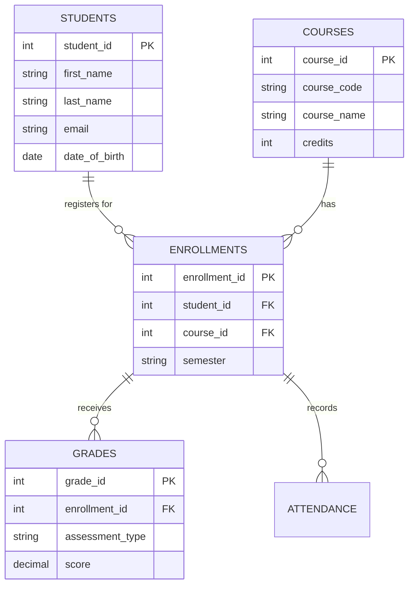
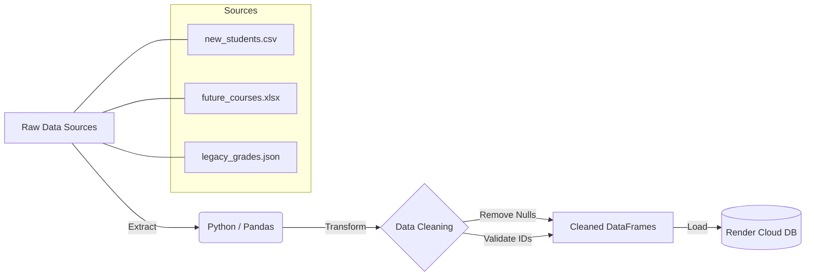

# Student Records Management System 🎓

`https://img.shields.io/badge/Python-3.12-blue?logo=python&logoColor=white`  
`https://img.shields.io/badge/PostgreSQL-16-4169E1?logo=postgresql&logoColor=white`  
`https://img.shields.io/badge/Deployment-Render_Cloud-black?logo=render`  
`https://img.shields.io/badge/Status-Production_Ready-green`

A robust, cloud-deployed **Data Engineering project** that manages student academic lifecycles.  
It features a normalized PostgreSQL database, a multi-source ETL pipeline (handling CSV, Excel, and JSON), and a secure Command Line Interface (CLI) for administration.

---

## 🏗️ Architecture

### 1. Entity-Relationship Diagram (ERD)
The database follows **3rd Normal Form (3NF)** to ensure data integrity and reduce redundancy.



### 2. ETL Pipeline Flowchart
Data is extracted from disparate sources, cleaned using **Pandas**, and loaded into the cloud database with referential integrity checks.



---

## 🚀 Key Features
- **Multi-Source ETL**: Ingests data from CSV (Students), Excel (Courses), and JSON (Grades).  
- **Cloud Deployment**: Database hosted on Render (PostgreSQL 16) with SSL security.  
- **Admin CLI**: Python-based menu to Add Students, Enroll, Grade, and Mark Attendance.  
- **Automated Reports**: Generates PDF transcripts and CSV exports on demand.  
- **Data Integrity**: Validates scores (0–100), prevents duplicates, and handles missing foreign keys gracefully.  
- **Unit Testing**: Automated test suite verifies ETL row counts and GPA calculation logic.  

---

## 📂 Database Schema

| Table       | Description                        | Key Columns                                |
|-------------|------------------------------------|--------------------------------------------|
| **students** | Core student profiles              | `student_id (PK)`, `email (Unique)`, `major` |
| **courses**  | Academic catalog                   | `course_id (PK)`, `course_code (Unique)`, `credits` |
| **enrollments** | Junction table linking students to courses | `enrollment_id (PK)`, `semester`, `enrollment_date` |
| **grades**   | Assessment scores                  | `score (0–100)`, `weight (0.0–1.0)`, `assessment_type` |
| **attendance** | Daily presence logs              | `status (Present/Absent/Late)`, `attendance_date` |

---

## 🛠️ Setup & Installation

1. **Clone the Repository**
   ```bash
   git clone https://github.com/KOM2047/Student-Records-Management-System.git
   cd Student-Records-Management-System
   ```

2. **Install Dependencies**
   ```bash
   pip install -r requirements.txt
   ```

3. **Configure Environment Variables**  
   Create a `.env` file in the root folder (do not commit this file!). Add your Render credentials:
   ```ini
   DB_HOST=dpg-xxxxxx.oregon-postgres.render.com
   DB_NAME=student_records_db_xxxx
   DB_USER=student_user_xxxx
   DB_PASS=your_secret_password
   ```

4. **Run the ETL Pipeline**  
   Populate the cloud database with the initial dataset:
   ```bash
   python src/etl_pipeline.py
   ```

---

## 📊 Usage Guide

### Administrator CLI
Run the interactive menu to manage records without writing SQL:
```bash
python src/cli_app.py
```

- **Option 1**: Add a new student (checks for duplicates).  
- **Option 4**: Mark attendance (safely updates daily logs).  
- **Option 5**: Generate reports (select "2" for PDF output).  

### Automated Testing
Run the quality assurance suite:
```bash
python tests/test_data_quality.py
```

- ✅ Verifies database constraints (e.g., rejecting grade > 100).  
- ✅ Verifies ETL volume (row counts).  
- ✅ Verifies business logic (GPA calculation).  

---

## 🔎 Analytics (SQL Examples)

### 1. Dean’s List (Top 10 Students)
```sql
SELECT first_name, last_name, ROUND(AVG(score), 2) as gpa
FROM student_transcripts_view
GROUP BY student_id, first_name, last_name
HAVING COUNT(score) > 3
ORDER BY gpa DESC
LIMIT 10;
```

### 2. At-Risk Students (Attendance < 75%)
```sql
SELECT s.last_name, c.course_code, 
       (present_days::decimal / total_days) * 100 as attendance_rate
FROM attendance_stats_view
WHERE (present_days::decimal / total_days) < 0.75;
```

---

## 📜 License
This project was developed as part of the **CAPACITI Data Engineering Career Accelerator**.
